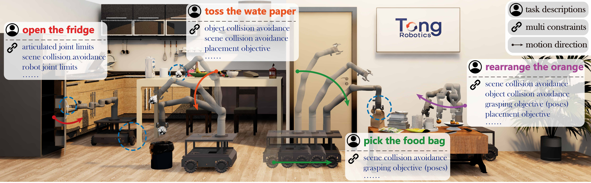

这是一个为你优化和重新排版后的 README 文档。我调整了徽章的对齐方式、美化了层级结构、增强了核心特性的排版，并优化了 `cokin` 部分的阅读体验。

你可以点击代码块右上角的“复制”按钮，一次性将整段内容复制并粘贴到你的 `README.md` 文件中。

````markdown
# M2Diffuser / diffuser-generation

<p align="left">
  <a href="https://m2diffuser.github.io/assets/paper/M2Diffuser.pdf"></a>
  <a href="https://arxiv.org/pdf/2410.11402"></a>
  <a href="https://m2diffuser.github.io/"></a>
  <a href="./environment.yaml"></a>
  <a href="./setup_env.sh"></a>
  <a href="./setup_env.sh"></a>
</p>

> 基于 Diffusion 的 3D 场景移动抓取（Mobile Manipulation）轨迹生成与优化框架。本项目提出了一种全新的 **CoKin** 双空间一致性耦合模块，用于实现关节空间（Joint-space）与末端执行器空间（End-effector-space）的联合学习。

<p align="left">
  <a href="https://youtu.be/T7kpDifRtfk?si=-R5agRpDM4uJKtuz"><strong>🎥 YouTube Demo</strong></a> |
  <a href="https://b23.tv/avOmoz0"><strong>📺 Bilibili Demo</strong></a> |
  <a href="https://huggingface.co/datasets/M2Diffuser/mec_kinova_mobile_manipulation/tree/main"><strong>💾 Datasets / Checkpoints</strong></a>
</p>



---

## 📖 Introduction

`diffuser-generation` 是一个面向 **mobile manipulation** 的轨迹生成框架。它的目标不仅仅是预测机器人的下一步动作，而是在给定 3D 场景点云、任务目标和机器人初始状态的前提下，直接生成一条 **可执行、可评估、可优化** 的完整轨迹。

项目当前包含三类核心模型：
- **M2Diffuser**：基于 DDPM 的轨迹生成模型，支持采样阶段的物理约束与任务引导。
- **MPiNets**：点云条件下的逐步 Motion Policy 基线模型。
- **MPiFormer**：基于 Transformer/GPT 风格序列建模的 Motion Policy 基线模型。

在此基础上，本仓库引入了一个核心研究模块：**`cokin`**。它将同一条轨迹同时置于 **joint space** 与 **pose space** 中建模，并通过可微正向运动学（Differentiable FK）建立一致性约束，有效缓解了“关节轨迹可行但末端行为不稳”或“末端目标合理但关节轨迹不一致”的常见问题。

---

## ✨ Core Features

- 🌌 **Scene-Conditioned Trajectory Diffusion** 使用场景点云编码器为扩散模型提供条件信息，直接生成 MecKinova 10-DoF 轨迹。
- 🛡️ **Constraint-Guided Sampling** 在采样阶段通过 `optimizer` 注入碰撞、关节限位、动作幅度、平滑性等约束梯度，超越纯生成范式。
- 🎯 **Task-Aware Planning Energy** 通过 `planner` 对抓取、放置、目标到达（goal-reach）等任务施加能量引导，引导采样过程朝“任务成功”方向优化。
- 🔗 **`cokin`: Dual-Space Consistency Coupling** 使用双分支 diffuser 分别学习 **pose trajectory** 和 **joint trajectory**，借助可微 FK 实现一致性耦合，是本仓库最核心的扩展模块。
- 📊 **Research-Friendly Baseline Suite** 统一数据流下保留了 MPiNets 与 MPiFormer 两个对比基线，极大方便了实验复现与消融分析（Ablation Study）。

---

## 🔍 Deep Dive into `cokin`

### 什么是 `cokin`？

`cokin` 对应的实现类为 `ConsistencyCoupledKinematicsDiffuser`。
- **核心代码**：[`models/m2diffuser/cokin.py`](./models/m2diffuser/cokin.py)
- **配置文件**：[`configs/diffuser/cokin.yaml`](./configs/diffuser/cokin.yaml)

`cokin` 并非简单地给 DDPM 添加 Loss，而是一个原生 **双分支 Diffuser**：
1. **Pose Branch**：学习末端执行器的 Pose 轨迹，默认维度 `7 = [x, y, z, qx, qy, qz, qw]`。
2. **Joint Branch**：学习机器人的 Joint 轨迹，针对 MecKinova 默认维度为 `10`。

训练时，通过 FK 将 joint 轨迹映射到 end-effector pose，并与 pose branch 的预测结果进行一致性约束。它解决了单一空间学习的弊端：让“关注关节运动的专家”与“关注末端空间路径的专家”达成共识。

### 核心机制与关键逻辑

#### 1. 训练目标 (Training Objective)
核心 Loss 由三部分组成：
```text
L_total = pose_diff_weight * L_pose_diff 
        + joint_diff_weight * L_joint_diff 
        + consistency_weight * L_consistency
````

*直觉：`pred_pose_x0 ≈ FK(pred_joint_x0)`，如果联合分支的 FK 结果与末端分支预测不一致，网络将受到惩罚。*

#### 2\. 双分支监督与自动 Target 构建

只要存在 Joint 轨迹监督信号，`cokin` 即可通过配置 `auto_pose_target_from_joint: true`，自动对其应用 FK 生成 Pose 分支所需的 Target 目标，无需显式提供 Pose 标注。

#### 3\. 可微 FK (Differentiable Forward Kinematics)

通过 `TorchURDFFKAdapter` 实现。默认配置下，会先将归一化到 `[-1, 1]` 的 Joint 轨迹还原至真实物理限位范围（`joint_unnormalize_for_fk: true`），再进行正向运动学计算。

#### 4\. 高级控制策略

  - `shared_timestep: true`：双分支共享 Diffusion 时间步，对齐训练信号。
  - `detach_pose_for_consistency` / `detach_joint_for_consistency`：单向阻断梯度回传，适用于消融实验。
  - 观测帧注入：Joint Branch 默认继承上下文，Pose Branch 侧重学习纯净末端分布。

> **⚠️ 当前状态提示**：当前仓库主要提供 `cokin` 的 **训练路径与消融架构**。完整的推理接口（如 `sample()`）目前仍沿用传统 DDPM 路线。

-----

## 🚀 Getting Started

### 1\. 环境要求

推荐运行环境：**Linux (Ubuntu 20.04) | NVIDIA GPU | Python 3.8.18 | PyTorch 1.13.1 + CUDA 11.6**

### 2\. 环境安装

运行一键安装脚本：

```bash
./setup_env.sh
```

*包含依赖：PyTorch 生态、`grasp_diffusion`、Pointnet2 Ops、Kaolin 等。*

### 3\. 手动修改 `yourdfpy`

请定位到环境中的 `yourdfpy/urdf.py`，手动修改缩放逻辑：

```python
new_s = new_s.scaled([geometry.mesh.scale[0], geometry.mesh.scale[1], geometry.mesh.scale[2]])
```

### 4\. 数据与资产准备

前往 [HuggingFace](https://huggingface.co/datasets/M2Diffuser/mec_kinova_mobile_manipulation/tree/main) 下载模型权重、数据集、URDF/USD 资产。
下载后请配置相关路径：

1.  放置 URDF 资产到对应目录。
2.  更新 [`utils/path.py`](https://www.google.com/search?q=./utils/path.py) 中的绝对路径。
3.  更新 Task YAML 中的 `data_dir`。

> **注意**：当前代码快照主要提供 `goal-reach` 任务的训练和推理入口。确保你的源码中包含 `datamodule/dataset/` 目录，否则训练无法启动。

-----

## 💻 Usage / Examples

### 🏃 训练 (Training)

**训练 M2Diffuser (标准 DDPM)**

```bash
bash ./scripts/model-m2diffuser/goal-reach/train.sh 1 ddpm
```

**训练 M2Diffuser (使用 CoKin 模块)**

```bash
bash ./scripts/model-m2diffuser/goal-reach/train.sh 1 cokin
```

*从最新 Checkpoint 恢复训练：只需在命令后追加 `latest` (例如：`... 1 cokin latest`)*

**直接使用 Hydra 启动 CoKin**

```bash
python train.py hydra/job_logging=none hydra/hydra_logging=none \
  exp_name=MK-M2Diffuser-Goal-Reach-CoKin \
  gpus="[0]" \
  diffuser=cokin \
  diffuser.loss_type=l2 \
  diffuser.timesteps=50 \
  model=m2diffuser_mk \
  +model@pose_model=cokin_pose_mk \
  +model@joint_model=cokin_joint_mk \
  model.use_position_embedding=true \
  task=mk_m2diffuser_goal_reach \
  task.train.num_epochs=2000
```

**训练对比基线模型**

```bash
bash ./scripts/model-mpinets/goal-reach/train.sh 1
bash ./scripts/model-mpiformer/goal-reach/train.sh 1
```

### 🧠 推理 (Inference)

运行带有物理约束和任务能量引导的 DDPM 采样：

```bash
bash ./scripts/model-m2diffuser/goal-reach/inference.sh <CKPT_DIR>
```

### 🧪 测试 (Testing)

**运行 CoKin Smoke Test (改动后的首选测试)**

```bash
python scripts/test_cokin_smoke.py
```

*此脚本用于验证：双分支前向是否可运行、自动 Pose Target 生成、Loss 字段及梯度反传是否正常。*

-----

## 📂 Architecture / Repo Structure

```text
diffuser-generation/
├── configs/                # Hydra 配置文件 (diffuser, model, optimizer, planner, task)
├── datamodule/             # 数据加载模块
├── env/                    # 机器人与仿真环境 (PyBullet, MecKinova)
├── models/                 # 核心模型实现
│   ├── base.py             # 模型与组件装配逻辑
│   ├── m2diffuser/         # DDPM与CoKin实现 (ddpm.py, cokin.py)
│   ├── mpinets/            # MPiNets 基线
│   ├── mpiformer/          # MPiFormer 基线
│   ├── optimizer/          # 采样阶段约束梯度计算
│   └── planner/            # 采样阶段任务能量引导
├── preprocessing/          # 数据预处理脚本
├── scripts/                # 训练、推理与测试的入口 Bash/Python 脚本
└── train.py / inference_*.py # 顶层执行文件
```

-----

## 📝 Citation

如果这个项目或其思路对你的研究有帮助，请引用我们的论文：

```bibtex
@article{m2diffuser2024,
  title={M2Diffuser: Diffusion-based trajectory generation and optimization for mobile manipulation in 3D scenes},
  author={...},
  journal={arXiv preprint arXiv:2410.11402},
  year={2024}
}
```

*注：请参考 [arXiv](https://www.google.com/search?q=https://arxiv.org/abs/2410.11402) 获取最新的作者及引用信息。*

## 🙏 Acknowledgement

本项目依赖并复用了多个优秀的开源库与研究成果，包括但不限于：
[`grasp_diffusion`](https://www.google.com/search?q=https://github.com/...)、[`Pointnet2_PyTorch`](https://www.google.com/search?q=https://github.com/...)、`pointops`、PyTorch Lightning 以及 Hydra。
相关集成代码位于 [`third_party`](https://www.google.com/search?q=./third_party) 目录。在此向这些开源项目的贡献者表示感谢！

```
```